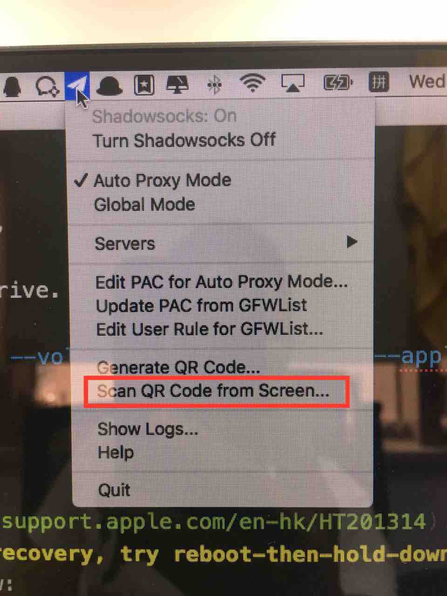

## **[cf-admin]** Local develop and test environment configuration step by step
### 1. OS X reinstall (if needed)
* [Create a bootable installer for OS X](https://support.apple.com/en-hk/HT201372) (we might already have that covered)
    * download os x from mac app store, then DO NOT click continue after installation begins,

    * run the following command, notice the */Volumes/MyVolume* should be path to your usb drive.
    ```bash
    sudo /Applications/Install\ OS\ X\ El\ Capitan.app/Contents/Resources/createinstallmedia --volume /Volumes/MyVolume --applicationpath /Applications/Install\ OS\ X\ El\ Capitan.app
    ```

* Reinstall using the install media
  * REBOOT(!important, sometimes shutdown-then-bootup doesn't work) into [recovery](https://support.apple.com/en-hk/HT201314) with the install media connected.  __(if do-nothing-while-rebooting doesn't get you straight into recovery, try reboot-then-hold-down command+R-immediately)__, if succeeded, you should see *os x utilities* window, e.g. below:
  

  * Erase disk in disk utility, select *Disk Utility*, erase the main disk.
  * Close *Disk Utility* window, in *OS X Utility* window, select *Reinstall OS X*
  * Fingers crossed that the reinstall goes as expected.

### 2. basic tools
  * **shadowsocks** install from github [**click here**](https://github.com/shadowsocks/ShadowsocksX-NG/releases)
    * scan QR code from screen  
    
    * QR code  
    

  * **hombrew**
  ```bash
  /usr/bin/ruby -e "$(curl -fsSL https://raw.githubusercontent.com/Homebrew/install/master/install)"
  ```
  * **GIT:**
  ```bash
  brew install git
  ```

  * **Chrome:** chrome comes in handy for testing web app with some awesome tools, including **postman**, **hostadmin** and of course, it's own Developer tools.

  * **Atom:** install atom from [**atom.io**](https://atom.io). Be sure to add atom shell by click menu **atom/install shell commands** on an active atom window.

  * **oh-my-zsh:** install with a single line of code:
  ```bash
  sh -c "$(curl -fsSL https://raw.githubusercontent.com/robbyrussell/oh-my-zsh/master/tools/install.sh)"
  ```
  docs are [here](https://github.com/robbyrussell/oh-my-zsh)

  * **Kaleidoscope:** download from file sharing service NAS. then goto menu *Kaleidoscope/integration...*, select git, follow the instructions.
    KaleidoscopeLicense also in the NAS.

  * **Axure:** Axure is a wireframing and prototyping tool for web and user experience designers. download from NAS.

### 3. node, mysql and nginx install and configuration
  * **Node.js**
    * install cnpm
    ```bash
    npm install -g cnpm --registry=https://registry.npm.taobao.org
    ```
    * install npm modules with cnpm
    ```bash
    cnpm i -g pm2 gulp gulp-cli bower webpack nodemon
    cnpm i -g eslint eslint-plugin-import eslint-config-airbnb-base
    ```
    * install with nvm:
    ```bash
    curl -o- https://raw.githubusercontent.com/creationix/nvm/v0.33.1/install.sh | bash
    nvm install v8.11.1
    nvm alias default v8.11.1
    ```

  * **Mysql**   
    installation and config:
    + Using `brew`:
    ```bash
    brew update
    brew install mysql
    brew services start mysql
    mysql_secure_installation
    ```

    * **Config mysql**, use mysql command line (make sure **PATH** include mysql: edit `/etc/paths` add line `/usr/local/mysql/bin`):</br>
      + login mysql shell:
      ```bash
      mysql -u root -p
      ```
      + `exit` and reenter as user `cfdev`, create database `cfdb`
      ```bash
      CREATE DATABASE cfdb
      CHARACTER SET utf8
      COLLATE utf8_general_ci;
      ```
      + create a user `cfdev`:
      ```bash
      CREATE USER 'cfdev'@'localhost' IDENTIFIED BY 'tongji2016';
      ```
      + and grant user privileges(if errored, reenter mysql shell as root):M
      ```bash
      GRANT ALL ON cfdb.* TO 'cfdev'@'localhost';
      ```
    * **Navicat Premium** Navicat Premium is a database administration tool. donwload from NAS.


  * **MongoDB** installation and config:
    + Using `brew`:
    ```bash
    brew install mongodb
    ```
    + manual install:
    docs are  [here](https://docs.mongodb.com/manual/tutorial/install-mongodb-on-os-x/).

    * **Config mongodb**:</br>
      + configuration file: docs are [here](https://docs.mongodb.com/v3.2/reference/configuration-options/)
      ```bash
      mongod -f /etc/mongod.conf
      ```

      + create user
      ```shell
      use cf-agenda;
      db.createUser({
        user: 'cfdev',
        pwd: 'tongji2016',
        //customData: { <any information> },
        roles: [
          {role:'dbAdmin', db:'cf-agenda'}
        ]
      });
      ```

  * **Nginx:** install with homebrew:

  ```bash
  brew install nginx
  brew services start nginx
  ```

  edit nginx config (using **cf-admin** as an example):

  ```bash
  cd /usr/local/etc/nginx/servers
  ```
  ```bash
  atom .
  ```
  create a test.cf-admin.conf edit as following:
  ```
  server {
    listen 80;
    server_name test.admin.careerfrog.com.cn;
    location / {
      proxy_pass http://127.0.0.1:3000;
    }
  }
  ```
  save the file, then reload nginx server:
  ```bash
  nginx -s reload
  ```

### 4. Dev Tools

  * Chrome Extensions(Chrome Webstore)
    * HostAdmin：
    open HostAdmin, and then click Editor  
    ```
      #==== Careefrog
      127.0.0.1	  test.careerfrog.com.cn

      127.0.0.1	  test.admin.careerfrog.com.cn

      127.0.0.1	  test.communication.careerfrog.com.cn

      127.0.0.1   test.scheduletask.careerfrog.com.cn

      127.0.0.1   test.client.careerfrog.com.cn

      127.0.0.1 	test.file.careerfrog.com.cn

      127.0.0.1 	test.callcenter.careerfrog.com.cn

      127.0.0.1 	test.51job.assessment.careerfrog.com.cn

      127.0.0.1   test.ceping.careerfrog.com.cn
      #====
    ```
    * EditThisCookie
  * Postman
